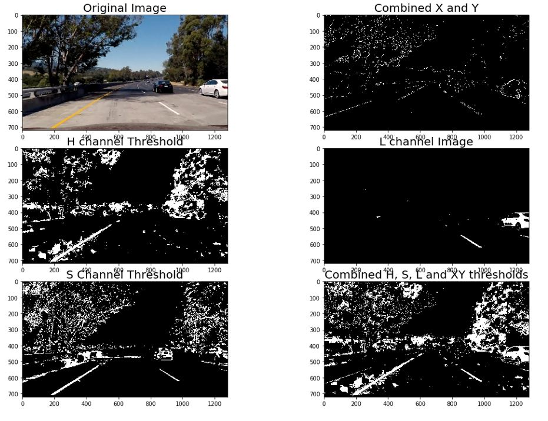

## Advanced Lane Finding

In this project, the goal is to write a software pipeline to identify the lane boundaries in a video.

The steps of this project are the following:

* Compute the camera calibration matrix and distortion coefficients given a set of chessboard images.
* Apply a distortion correction to raw images.
* Use color transforms, gradients, etc., to create a thresholded binary image.
* Apply a perspective transform to rectify binary image ("birds-eye view").
* Detect lane pixels and fit to find the lane boundary.
* Determine the curvature of the lane and vehicle position with respect to center.
* Warp the detected lane boundaries back onto the original image.
* Output visual display of the lane boundaries and numerical estimation of lane curvature and vehicle position.

## [Rubric](https://review.udacity.com/#!/rubrics/571/view) Points

### Here I will consider the rubric points individually and describe how I addressed each point in my implementation.  

---

### Writeup / README

#### 1. Provide a Writeup / README that includes all the rubric points and how you addressed each one.  You can submit your writeup as markdown or pdf.  [Here](https://github.com/udacity/CarND-Advanced-Lane-Lines/blob/master/writeup_template.md) is a template writeup for this project you can use as a guide and a starting point.  

You're reading it!

### Camera Calibration

#### 1. Briefly state how you computed the camera matrix and distortion coefficients. Provide an example of a distortion corrected calibration image.

The code for this step is contained in the first code cell of the IPython notebook located in "./project.ipynb".  

The OpenCV functions `findChessboardCorners()` and `calibrateCamera()` were used to automatically find and draw corners in an image of a chessboard pattern, and are backbone for this image calibration. 

The `findChessboardCorners()` attempts to determine whether the input image is a view of the chessboard pattern and locate the internal chessboard corners. Here in this project, the input comprise of a number of chessboard images ( 9 x 6 squares used in this project, points where two black and two white squares intersect) taken from different angles, using the same camera. The `findChessboardCorners()` returns a non-zero value if all of the corners are found and they are placed in a certain order. Otherwise, if the function fails to finds all the corners or reorder them, it returns 0, which can be noticed in the below image where corners were not detected in 3 of the fed inputs. Once an array of detected corners are found, `drawChessboardCorners()` can be used to render the detected chessboard corners as shown below.


Once an arrays of object points, corresponding to the internal corners of a chessboard, and image points, the pixel locations of the internal chessboard corners are found using `findChessboardCorners()`, can be fed to `calibrateCamera()` which returns camera calibration and distortion coefficients. These can then be used by the OpenCV `undistort()` to undo the effects of distortion on any image produced by the same camera. Example shown below.


### Pipeline (single images)

#### 1. Provide an example of a distortion-corrected image.

Distortion correction applied to some of the test images can be seen below. Changes can be noticed between original image (on left) and undistorted images (on right) when looking at the car hood.


#### 2. Describe how (and identify where in your code) you used color transforms, gradients or other methods to create a thresholded binary image.  Provide an example of a binary image result.

I started with HLS color space with an approach of identifying yellow lines and white lines using HLS s,h channel and l channel. To detect all the lines properly I tried to see how several combinations of hls color thresholds with x, y, xy gradients looks like. At some point, I was able to detect the yellow and white lines sucessfully under balanced light conditions, but this combination still fails when there are shadows in images and when the images are bright. Code for this is titled 'Working with HLS color space' in project.ipynb file. One example can be seen below.



After reading some papers on shadow detection (one reference [here](./references/shadow%20detection.pdf)) I started working with LAB color space. I started with B channel to detect yellow color and L channel to find white lines. By combining B and L channel thresholds I was able to successfully detect the shadows. Rather than working on removing shadows, I used LAB B channel threshold in combination with HLS L channel threshold to generate a binary image that detects yellow and white lines successully. I then applied normalization to LAB B channel (only when yellow is found) and HLS L channel. These can be seen in `lab_b_threshold()` and `hls_l_threshold()` in my `project.ipynb` file. Code for this is titled 'Working with LAB B channel and HLS L channel' in `project.ipynb` file.One example can be seen below.


#### 3. Describe how (and identify where in your code) you performed a perspective transform and provide an example of a transformed image.

The code for perspective transform is titled 'Perspective transform' in `project.ipynb` file.  The `warper()` function takes as inputs an image (`img`), as well as source (`src`) and destination (`dst`) points.  I chose to hardcode the source and destination points in the following manner:

```python
src = np.float32([(135,imshape[0]),
                   (580, 460), 
                   (730, 460), 
                   (1200,imshape[0])])
dst = np.float32([(320,720),
                  (920,720),
                  (320,0),
                  (920,0)])
```

I verified that my perspective transform was working as expected by drawing the `src` and `dst` points onto a test image and its warped counterpart to verify that the lines appear parallel in the warped image. Images below demonstrate the results of the perspecive transform.


#### 4. Describe how (and identify where in your code) you identified lane-line pixels and fit their positions with a polynomial?

Once we have the binary image after applying calibration, thresholding and a perspective transform to a road image, where we can clearly see the lane lines, we can then implement sliding window. The functions `blind_search()` and `quick_lane_finder()`, which identify lane lines and fit a second order polynomial to both right and left lane lines, are labeled in the Jupyter notebook as "Implement Sliding Windows" and "Fit a Polynomial using previous fits".

`blind_search()` computes a histogram of the lower half of the image and finds the bottom-most x position of the left and right lane lines. In my thresholded binary image, pixels are either 0 or 1, so the two most prominent peaks in this histogram will be good indicators of the x-position of the base of the lane lines. Originally these locations were identified from the local maxima of the left and right halves of the histogram, but in my final approach I have changed these to quarters of the histogram just left and right of the midpoint. This helped to reject any lines from adjacent lanes. The function then identifies nine windows from which to identify lane pixels, each one centered on the midpoint of the pixels from the window below. This effectively follows the lane lines up to the top of the binary image, and speeds processing by only searching for activated pixels over a small portion of the image. Pixels belonging to each lane line are identified and the Numpy polyfit() fits a second order polynomial to each set of pixels. Image below demonstrates the results.


Once I know where the lines are I have a fit! In the next frame of video I don't need to do a blind search again, but instead I can just search in a margin around the previous line position using `quick_lane_finder()`, labeled as "Fit a Polynomial using previous fits".
Below image demonstrates the result, with the green shaded area is the range from the previous fit, and the yellow lines are from the current image.


#### 5. Describe how (and identify where in your code) you calculated the radius of curvature of the lane and the position of the vehicle with respect to center.

The radius of curvature is calculated based on the [reference](https://www.intmath.com/applications-differentiation/8-radius-curvature.php) and is labelled as "Radius of Curvature" in my project file.

The pixel values of the lane are scaled into meters using the scaling factors defined as follows:

ym_per_pix = 30/720 # meters per pixel in y dimension
xm_per_pix = 3.7/700 # meteres per pixel in x dimension

These values are then used to compute the polynomial coefficients in meters and then the formula given in the lectures is used to compute the radius of curvature.

The camera is assumed to be centered in the vehicle and checks how far the midpoint of the two lanes is from the center of the image.

lane_center = (left_fitx[719] + right_fitx[719])/2
xm_per_pix = 3.7/700 # meters per pixel in x dimension
center_offset_pixels = abs(binary_warped.shape[1]/2 - lane_center)
center_offset_mtrs = xm_per_pix*center_offset_pixels

left_fitx and right_fitx are the x-intercepts of the left and right fits, respectively. This requires evaluating the fit at the maximum y value (719, in this case - the bottom of the image) because the minimum y value is actually at the top. The car position is the difference between these intercept points and the image midpoint.

#### 6. Provide an example image of your result plotted back down onto the road such that the lane area is identified clearly.

This is labelled as 'Draw the measurement back down onto the road' in my project.ipynb file. A polygon is generated based on plots of the left and right fits, warped back to the perspective of the original image using the inverse perspective matrix Minv and overlaid onto the original image. 


The image below demonstrates final ouput after going throught the complete pipeline and can be seen under "Final pipeline" in my project/ipynb file.


---

### Pipeline (video)

#### 1. Provide a link to your final video output.  Your pipeline should perform reasonably well on the entire project video (wobbly lines are ok but no catastrophic failures that would cause the car to drive off the road!).

Here's a [link to my video result](./project_video_output.mp4)

Here's a [link to my challenge video result](./challenge_video_output.mp4)

The lanes in the challenge video still need some tuning for initial few seconds and the lanes in the harder challenge video were found to be very difficult to track with this pipeline. The algorithm has to be improved and made more robust for that video.

---

### Discussion

#### 1. Briefly discuss any problems / issues you faced in your implementation of this project.  Where will your pipeline likely fail?  What could you do to make it more robust?

Most of the problems I encountered were due to lighting conditions, shadows, etc. It took me some time to get the proper combination of thresholds parameters to get the pipeline to perform well on the original project video but still see a lot of issues with challenge video. But after using LAB channel, particularly after discovering the B channel of the LAB colorspace, which isolates the yellow lines very well, even on the lighter-gray bridge sections that comprised the most difficult sections of the video, the pipeline does perform better on project video and with some issues in challenge video. The lane lines don't necessarily occupy the same pixel value (speaking of the L channel of the HLS color space) range on this video that they occupy on the first video, so the normalization/scaling technique helped here quite a bit, although it also tended to create problems (large noisy areas activated in the binary image) when the white lines didn't contrast with the rest of the image enough. This would be an issue in snow or in a situation where, for example, a bright white car were driving among dull white lane lines. Producing a pipeline from which lane lines can reliably be identified was of utmost importance, but smoothing the video output by averaging the last n found good fits also helped (implemented in save_fit() in project.ipynb file). My approach also invalidates fits if the left and right base points aren't a certain distance apart (within some tolerance) under the assumption that the lane width will remain relatively constant.


