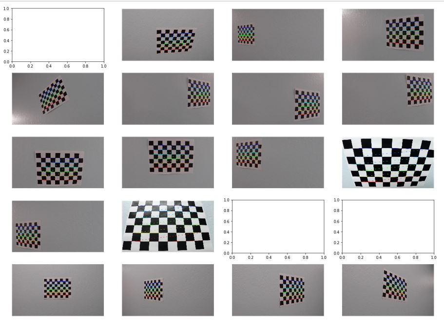
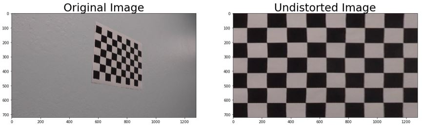
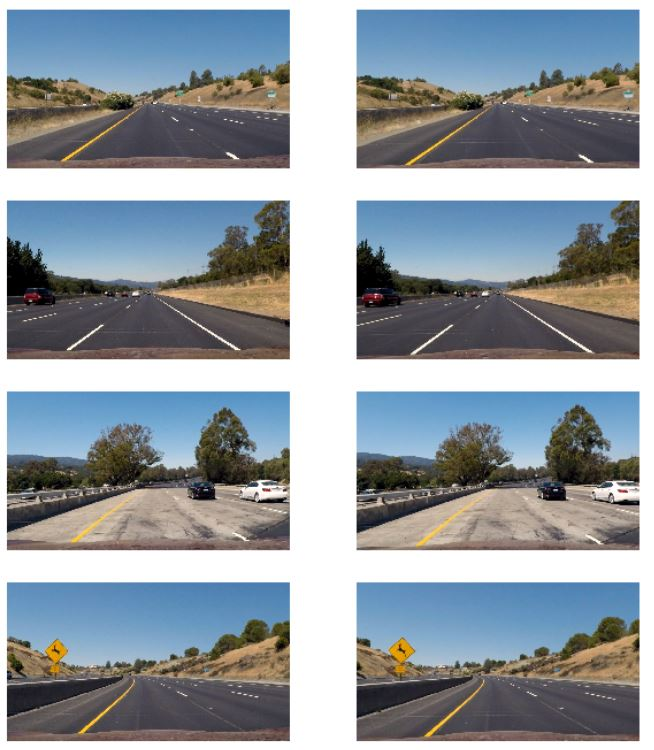
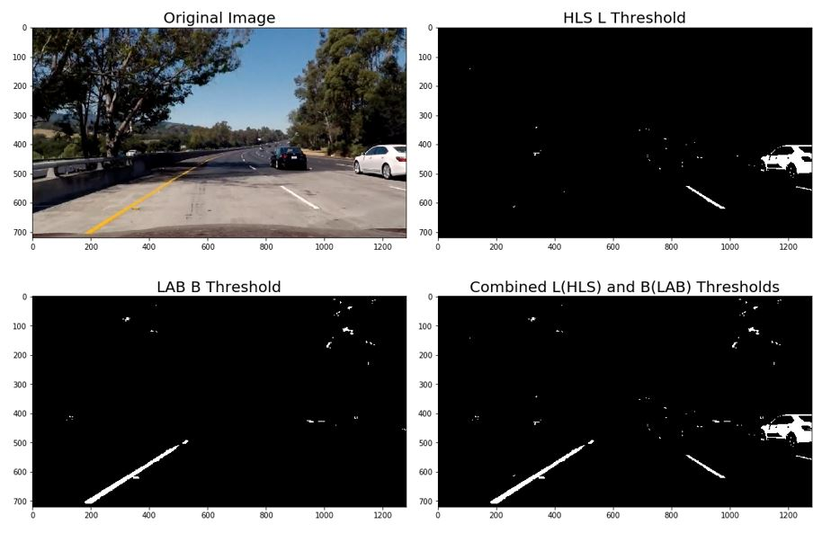
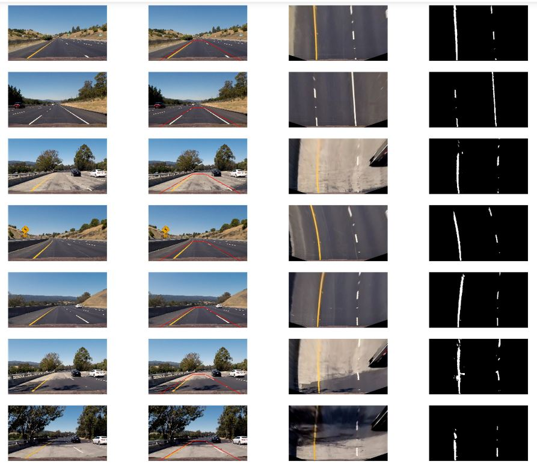

## Advanced Lane Finding

In this project, the goal is to write a software pipeline to identify the lane boundaries in a video.

The steps of this project are the following:

* Compute the camera calibration matrix and distortion coefficients given a set of chessboard images.
* Apply a distortion correction to raw images.
* Use color transforms, gradients, etc., to create a thresholded binary image.
* Apply a perspective transform to rectify binary image ("birds-eye view").
* Detect lane pixels and fit to find the lane boundary.
* Determine the curvature of the lane and vehicle position with respect to center.
* Warp the detected lane boundaries back onto the original image.
* Output visual display of the lane boundaries and numerical estimation of lane curvature and vehicle position.

## [Rubric](https://review.udacity.com/#!/rubrics/571/view) Points

### Here I will consider the rubric points individually and describe how I addressed each point in my implementation.  

---

### Writeup / README

#### 1. Provide a Writeup / README that includes all the rubric points and how you addressed each one.  You can submit your writeup as markdown or pdf.  [Here](https://github.com/udacity/CarND-Advanced-Lane-Lines/blob/master/writeup_template.md) is a template writeup for this project you can use as a guide and a starting point.  

You're reading it!

### Camera Calibration

#### 1. Briefly state how you computed the camera matrix and distortion coefficients. Provide an example of a distortion corrected calibration image.

The code for this step is contained in the first code cell of the IPython notebook located in "./project.ipynb".  

The OpenCV functions findChessboardCorners() and calibrateCamera() were used to automatically find and draw corners in an image of a chessboard pattern, and are backbone for this image calibration. 

The findChessboardCorners() attempts to determine whether the input image is a view of the chessboard pattern and locate the internal chessboard corners. Here in this project, the input comprise of a number of chessboard images ( 9 x 6 squares used in this project, points where two black and two white squares intersect) taken from different angles, using the same camera. The findChessboardCorners() returns a non-zero value if all of the corners are found and they are placed in a certain order. Otherwise, if the function fails to finds all the corners or reorder them, it returns 0, which can be noticed in the below image where corners were not detected in 3 of the fed inputs. Once an array of detected corners are found, drawChessboardCorners() can be used to render the detected chessboard corners as shown below.



Once an arrays of object points, corresponding to the internal corners of a chessboard, and image points, the pixel locations of the internal chessboard corners are found using findChessboardCorners(), can be fed to calibrateCamera() which returns camera calibration and distortion coefficients. These can then be used by the OpenCV undistort() to undo the effects of distortion on any image produced by the same camera. Example shown below.



### Pipeline (single images)

#### 1. Provide an example of a distortion-corrected image.

Distortion correction applied to some of the test images can be seen below. Changes can be noticed between original image (on left) and undistorted images (on right) when looking at the car hood.



#### 2. Describe how (and identify where in your code) you used color transforms, gradients or other methods to create a thresholded binary image.  Provide an example of a binary image result.

I started with HLS color space with an approach of identifying yellow lines and white lines using HLS s,h channel and l channel. To detect all the lines properly I tried to see how several combinations of hls color thresholds with x, y, xy gradients looks like. At some point, I was able to detect the yellow and white lines sucessfully under balanced light conditions, but this combination still fails when there are shadows in images and when the images are bright. Code for this is titled 'Working with HLS color space' in project.ipynb file. One example can be seen below.


After reading some papers on shadow detection (one refernce [here](./references/shadow_detection.pdf)) I started wworking with LAB color space. I started with B channel to detect yellow color and L channel to find white lines. By combining B and L channel thresholds I was able to successfully detect the shadows. Rather than working on removing shadows, I used LAB B channel threshold in combination with HLS L channel threshold to generate a binary image that detects yellow and white lines successully. I then applied normalization to LAB B channel (only when yellow is found) and HLS L channel. These can be seen in lab_b_threshold() and hls_l_threshold() in my project.ipynb file. Code for this is titled 'Working with LAB B channel and HLS L channel' in project.ipynb file.One example can be seen below.



#### 3. Describe how (and identify where in your code) you performed a perspective transform and provide an example of a transformed image.

The code for perspective transform is titled 'Perspective transform' in project.ipynb file.  The `warper()` function takes as inputs an image (`img`), as well as source (`src`) and destination (`dst`) points.  I chose to hardcode the source and destination points in the following manner:

```python
src = np.float32([(135,imshape[0]),
                   (580, 460), 
                   (730, 460), 
                   (1200,imshape[0])])
dst = np.float32([(320,720),
                  (920,720),
                  (320,0),
                  (920,0)])
```

I verified that my perspective transform was working as expected by drawing the `src` and `dst` points onto a test image and its warped counterpart to verify that the lines appear parallel in the warped image. Images below demonstrate the results of the perspecive transform.



#### 4. Describe how (and identify where in your code) you identified lane-line pixels and fit their positions with a polynomial?

Then I did some other stuff and fit my lane lines with a 2nd order polynomial kinda like this:

![alt text][image5]

#### 5. Describe how (and identify where in your code) you calculated the radius of curvature of the lane and the position of the vehicle with respect to center.

I did this in lines # through # in my code in `my_other_file.py`

#### 6. Provide an example image of your result plotted back down onto the road such that the lane area is identified clearly.

I implemented this step in lines # through # in my code in `yet_another_file.py` in the function `map_lane()`.  Here is an example of my result on a test image:

![alt text][image6]

---

### Pipeline (video)

#### 1. Provide a link to your final video output.  Your pipeline should perform reasonably well on the entire project video (wobbly lines are ok but no catastrophic failures that would cause the car to drive off the road!).

Here's a [link to my video result](./project_video.mp4)

---

### Discussion

#### 1. Briefly discuss any problems / issues you faced in your implementation of this project.  Where will your pipeline likely fail?  What could you do to make it more robust?

Here I'll talk about the approach I took, what techniques I used, what worked and why, where the pipeline might fail and how I might improve it if I were going to pursue this project further.  
